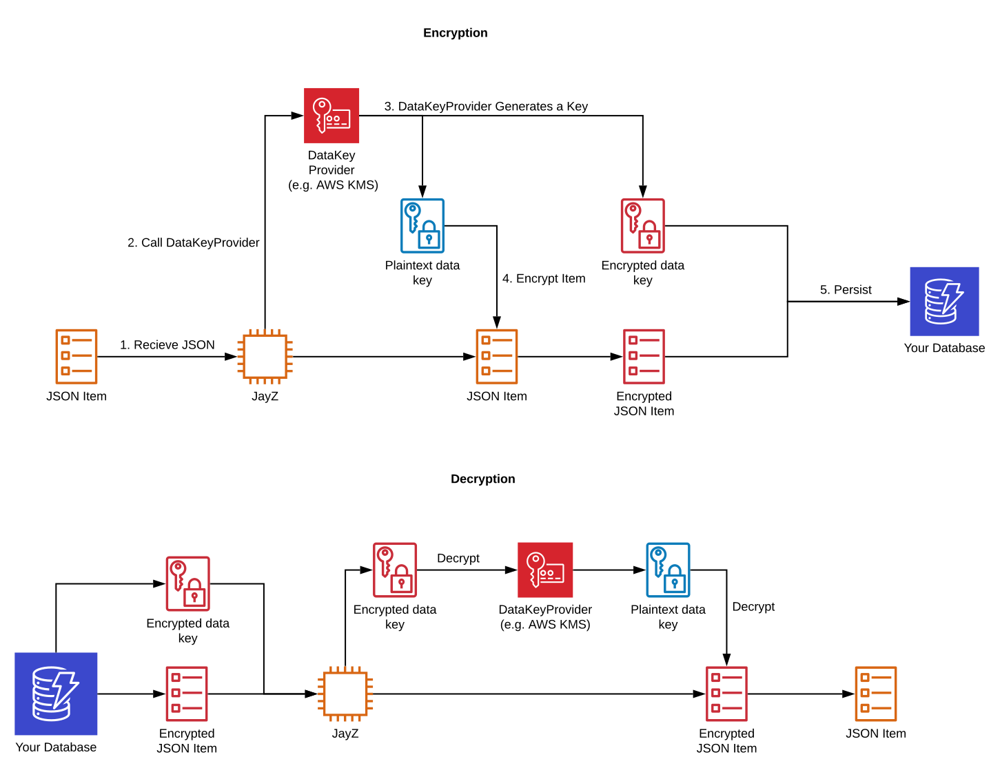

# Jay-Z

> You've got 99 problems, but application-layer encryption ain't one.

Jay-Z is a TypeScript library that makes sever-side data encryption super easy at the application layer.
It's built on [libsodium](https://github.com/jedisct1/libsodium.js) and supports AWS KMS out of the box.

And if you're persisting data to DynamoDB - JayZ loves [Beyonce](https://github.com/ginger-io/beyonce). She supports him out the box (obviously).

## Motivation

Given the prevalence of mass data leaks, server-side encryption should be a _requirement_ for any app you build that touches sentive data - e.g. PII.

Most cloud-based databases support a server-side encryption option. For example [AWS DynamoDB](https://docs.aws.amazon.com/amazondynamodb/latest/developerguide/EncryptionAtRest.html).

This is a nice feature to have. But it's not sufficient security since data is encrypted at the data layer instead of the application layer. In the case of AWS, this means that anybody with access to your data store via the API or console is able to read the data is plaintext.

Jay-Z helps you with this problem by encrypting your data at the application layer, before sending it to your data store. That way you need _more_ than just API or console access to read the data - you need the key.

JayZ is designed to work with KMS. But you can bring your own keys too.

## Usage

### 1. Install

First install jay-z - `npm install @ginger.io/jay-z`

### 2. Get yourself a JayZ

```TypeScript
import { KMS } from "aws-sdk"
import { KMSDataKeyProvider, JayZ } from "@ginger.io/jay-z"

const kmsKeyId = "..." // the KMS key id or arn you want to use
const keyProvider = new KMSDataKeyProvider(kmsKeyId, new KMS())
const jayZ = new JayZ({ keyProvider })
```

### 3. Encrypt Data

```TypeScript
type BankAccount = {
  id: string
  accountNumber: string
  routingNumber: string
}

const bankAccount: BankAccount = {
  id: "1",
  accountNumber: "an-123",
  routingNumber: "rn-123"
}

const encryptedItem = await jayZ.encryptItem(bankAccount, ["accountNumber", "routingNumber"])
```

Here you specify _only_ the fields you want encrypted. JayZ doesn't suffer foolish mistakes - so this API is completely type-safe.

The return type of `encryptedItem` is a TypeScript [Mapped Type](https://www.typescriptlang.org/docs/handbook/advanced-types.html#mapped-types). Encrypted fields types are changed to `Uint8Array`s and the types of non-encrypted fields are passed through.

### 4. Decrypt Data

If you have the encrypted item in scope with the right types,
you can just do:

```TypeScript
  const decryptedItem = await jayZ.decryptItem(encrypted))
```

And the correct type, `BankAccount` in this example will be automatically inferred.

If you need to specify the type, just do:

```TypeScript
  const decryptedItem = await jayZ.decryptItem<BankAccount, any>(encrypted))
```

## Reusing Data Keys

By default, JayZ will request a fresh data key from its `DataKeyProvider` on every encryption operation. If you'd like to trade security for speed and/or cost - you can configure this with the `maxUsesPerDataKey` setting:

```TypeScript
const jayZ = new JayZ({ keyProvider: ..., maxUsesPerDataKey: 100 })
```

This would use each data key for 100 `encrypt` operations, before requesting a fresh key from the configured `DataKeyProvider`.

## Design

### Diagram



### Additional Details

1. Every time you encrypt data, JayZ uses the passed `DataKeyProvider` to generate key material. For example, if you're using the `KMSDataKeyProvider` it will make an API call to [`generateDataKey`](https://docs.aws.amazon.com/AWSJavaScriptSDK/latest/AWS/KMS.html#generateDataKey-property).

2. That key material is passed through libsodium's key derivation function, `crypto_kdf_derive_from_key`(https://libsodium.gitbook.io/doc/key_derivation) to produce an encryption key. The reason we do this is we might want to eventually support deriving othe types of keys as well - e.g. a signing key for a custom signature.

3. Then, JayZ uses libsodium's [`secretbox`](https://libsodium.gitbook.io/doc/secret-key_cryptography/secretbox) to perform authenticated encryption and decryption using the derived key. Encryption performed on a per-field basis, and only on the specified fields.

4. A `__jayz__metadata` field is appended to your object. This contains data like the encrypted data key (provided by the KeyProvider), the generated nonce, a list of field names that were encrypted and the encryption scheme version.

5. When it's time to decrypt data, JayZ grabs the `__jayz__metadata` field off the object and asks the `DataKeyProvider` to decrypt the data key (e.g. `KMSDataKeyProvider` makes an API call to [`decrypt`](https://docs.aws.amazon.com/AWSJavaScriptSDK/latest/AWS/KMS.html#decrypt-property)). We re-derive the encryption key (same step as #2 above) and use that to decrypt each encrypted field on your object.
